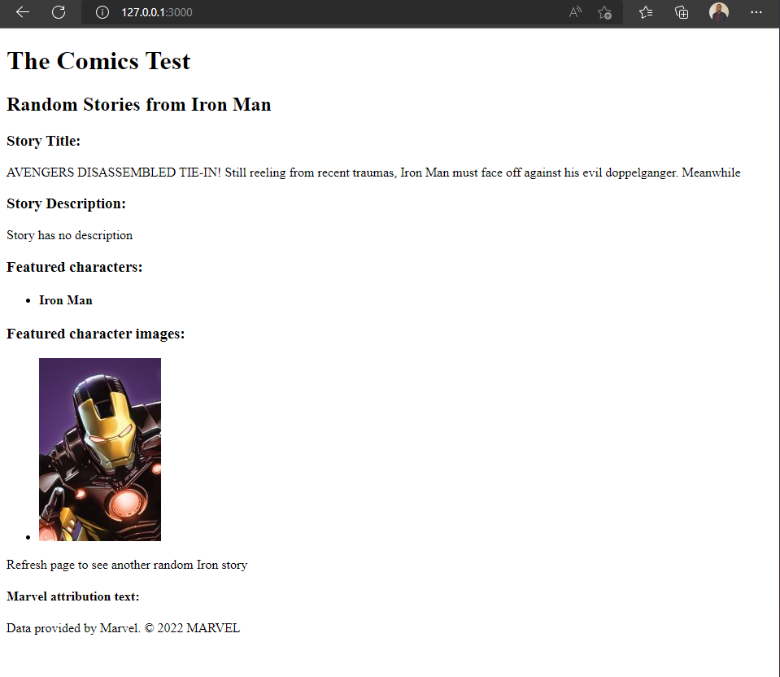

# The Comics Test
An HTML page that displays a superhero's story and the characters featured in it from Marvel comics.

## Usage

* Clone repo locally and install dependencies
Make sure you have ruby 3.1.2 or later installed, Rails 7.0.0 or later as well as the gem package 'bundle'. Clone the repo and then run the following commands:

```bash
install bundle
virtualenv venv
```

* Run Rails on your local server

```bash
rails s
```

* Open http://127.0.0.1:3000/ in your browser.


